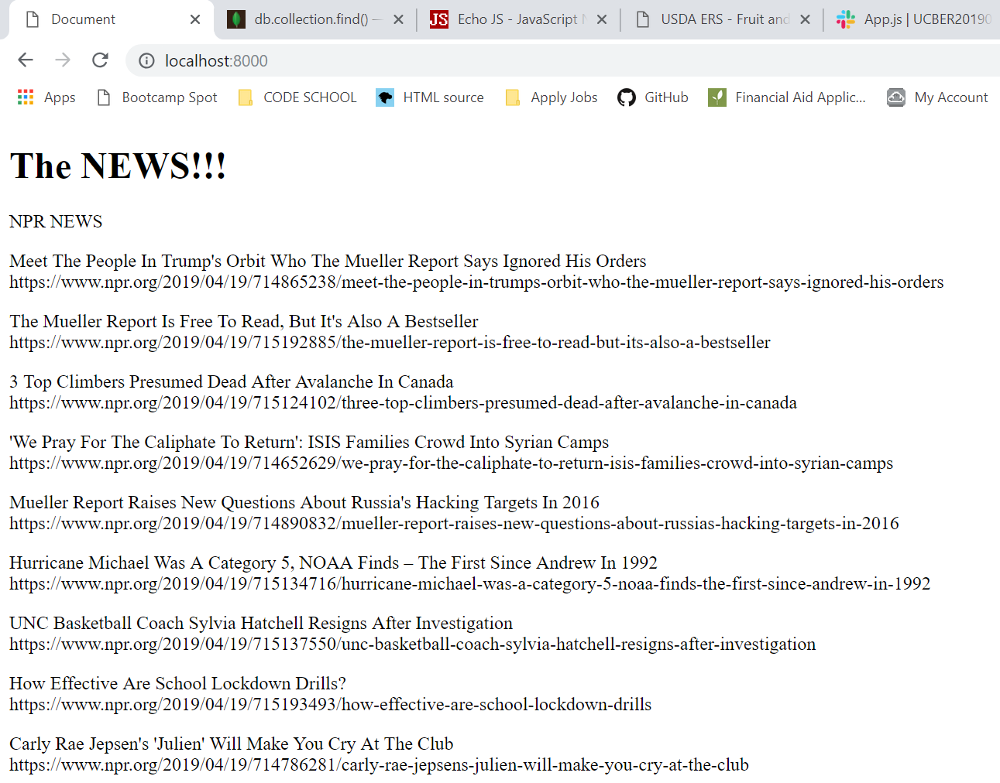
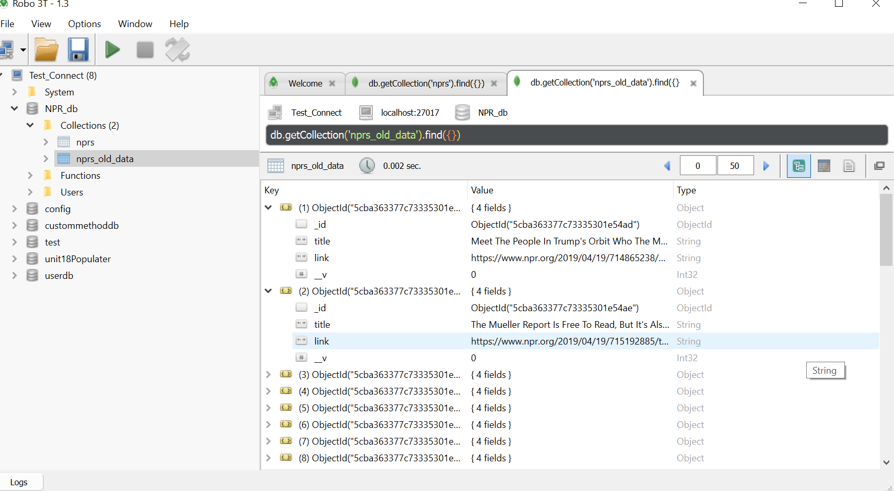
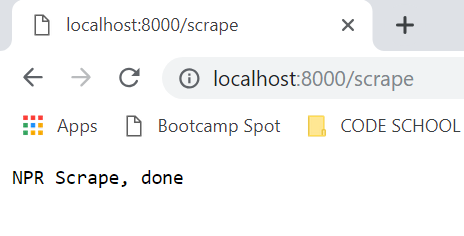
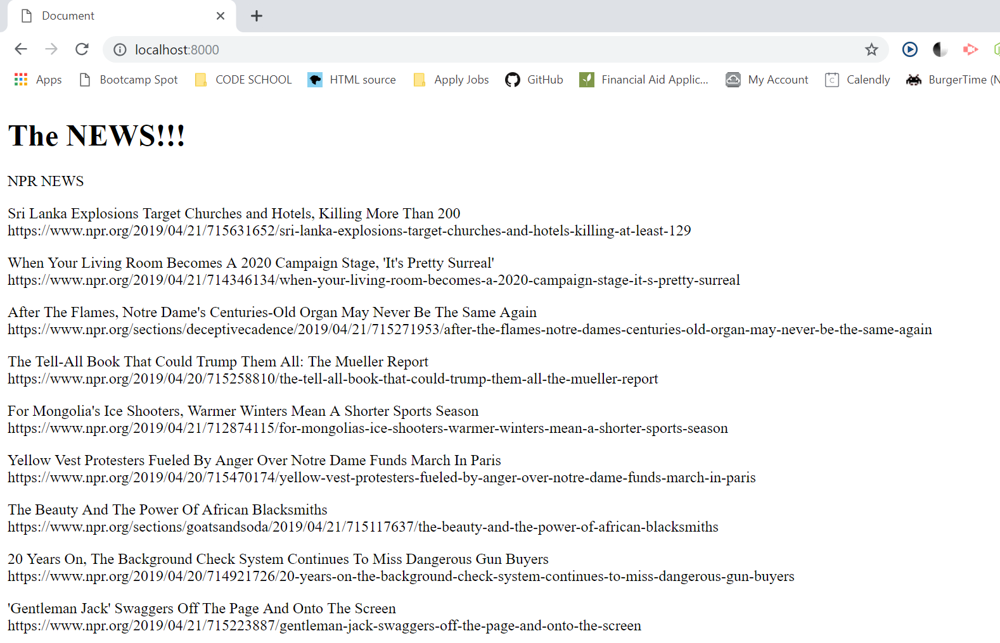
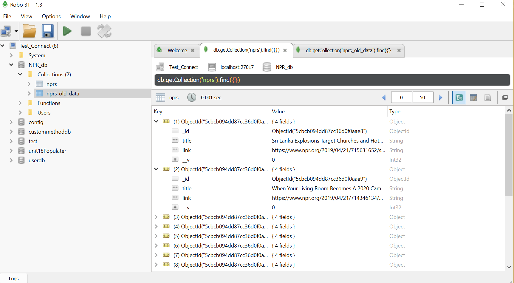

# Data Scraper

This a a data scraping exercise using MYSQL and Javascript/NodeJS. 

## Installation

Node package managers to install: axios, cheerio, express, mongojs, mongoose, morgan

```bash
npm install axios cheerio express mongojs mongoose morgan
```

## Usage

```javascript
 node server.js                // start the server 
```

The data from NPR is scraped and stored in a database and then displayed back on the home page of the website. This is example data from a previous run of the program. 



I changed the name of the datbase in order to recreate a new one for this demo.  Note the top stories displayed in the database named old_data



Now we return to the browser and hit the route "/scrape"  in order to retreive up to date data from npr.com 



When we return to the homepage or "/" route we will see updated top stories. 



This is now stored in the database names NPR Data



## Future Goals
I would like to add a scrape button so we don't have to manually enter the route into the browser.  I would also like to pull news from 2 more sites to compare top stories for the day. 


## Contributing
Pull requests are welcome. For major changes, please open an issue first to discuss what you would like to change.

Please make sure to update tests as appropriate.

## License
[MIT](https://choosealicense.com/licenses/mit/)